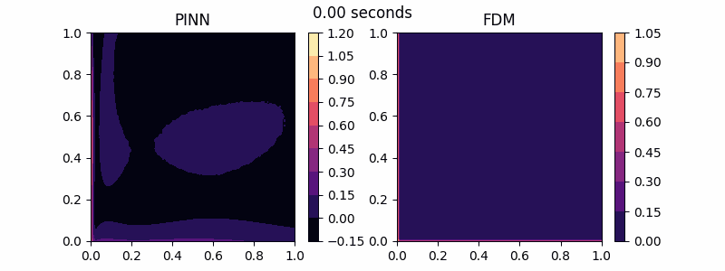

  <h1>HeatEq-PINN</h1>
  <h2>Physics-Informed Neural Network (PINN) Approach on Heat Equation</h2>
  
   
  

## Overview

This repository contains the implementation of a Physics-Informed Neural Network (PINN) to solve time-dependent heat equation. The goal is to leverage the power of neural networks combined with the physical principles of the heat equation to predict temperature distributions over time and space.

---

## Table of Contents

- [Introduction](#introduction)
- [Finite Difference](#finite-difference)
- [PINN](#pinn)

## Introduction

**2D Time-Dependent Heat Equation**
The 2D time-dependent heat equation describes how temperature diffuses over two-dimensional region by considering heat transfer through both space and time. The mathematical formulation of 2D Heat Equation was invented by Joseph Fourier in 1822 and expressed as follows:

$$U_t(x,y,t) = \alpha(U_xx(x,y,t)+U_yy(x,y,t))$$

We initialized our Dirichlet Boundary Conditions of our problem to be as follows:

## Finite Difference

## PINN

